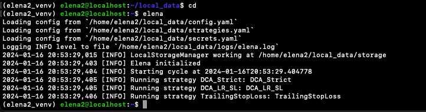

# Pure Python 

!!! note "Note:" 
    This is a work in progress. It's a software configuration guide. This Is Not Financial Advice.

## Pre requisites

The pure-python install assumes that you are working on a linux machine running Debian 12 (bookworm) or similar Raspberry Pi OS using Python 3.11

### System libraries
Most Debian had already installed Python3 and its basics components, but you may want to run this _apt installs_ as root or sudo:

```shell
apt update
apt install -y python3 build-essential git libssl-dev gcc python3.11-venv wget cron
```
### Dedicated user

It's recommended to create a dedicated user. This guide also assumes that.
```shell
useradd elena2 --user-group --create-home --shell /bin/bash 
```

## Modules installation

Logged as the dedicated user, install the modules on a new virtual environment.

The modules are:

- elena: main trading lib.
- elena-basics: basic strategies _ready to use_.
- elena-notifications-telegram: plugin to send notifications to telegram.

```shell
python3 -m venv elena2_venv
source elena2_venv/bin/activate
pip install -U pip setuptools wheel
pip install git+https://github.com/Pasta-fantasia/elena.git@v2.3.2
pip install git+https://github.com/Pasta-fantasia/elena-basics.git@v0.0.17 
pip install git+https://github.com/Pasta-fantasia/elena-notifications-telegram.git@v0.0.1
```

## Create a data directory 

```shell
mkdir $HOME/local_data
```

## Create basic configuration files

```shell
cd $HOME/local_data
wget https://raw.githubusercontent.com/Pasta-fantasia/elena-docs/main/docs/assets/configs_2.3.2/config.yaml
wget https://raw.githubusercontent.com/Pasta-fantasia/elena-docs/main/docs/assets/configs_2.3.2/secrets.yaml
wget https://raw.githubusercontent.com/Pasta-fantasia/elena-docs/main/docs/assets/configs_2.3.2/strategies.yaml
```
## Test

```shell
cd
elena
```
You should see something like:



## Configure bash environment 
```
echo "source $HOME/elena2_venv/bin/activate" >> $HOME/.bashrc
echo "export ELENA_HOME=$HOME/local_data" >> $HOME/.bashrc
source $HOME/.bashrc
```

## Configure cron

Download the cron shell script:
```
wget https://raw.githubusercontent.com/Pasta-fantasia/elena-docs/main/docs/assets/configs_2.3.2/cron.sh
```

Check that `cron.sh` is pointing to your Python virtual environment and `ELENA_HOME` by running `bash cron.sh`, you should find `last.log` file on `$HOME` with the same contents of the image above.


Add this line using `crontab -e`:
```
* * * * * BASH_ENV=~/.bashrc bash -c -l "bash cron.sh"
```

Wait for a minute, and you should find `last.log` file on `$HOME` with the same contents of the image above.

## Congratulations!

Now you have the basic Elena installed.
The next step is to configure the [exchanges](/02_config/exchanges/), [telegram](/02_config/telegram/) (optional) and your [strategies](/03_strategies/).