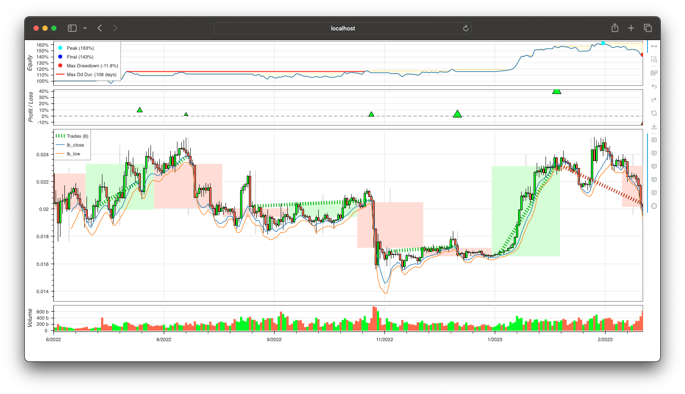
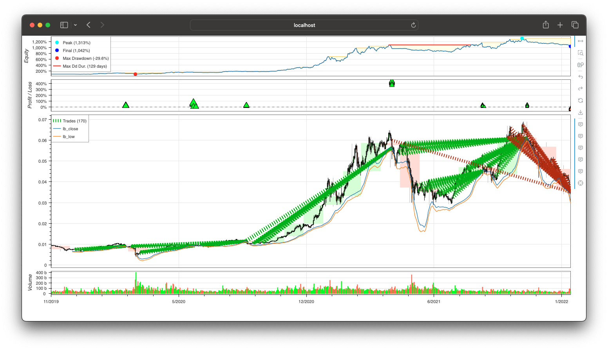
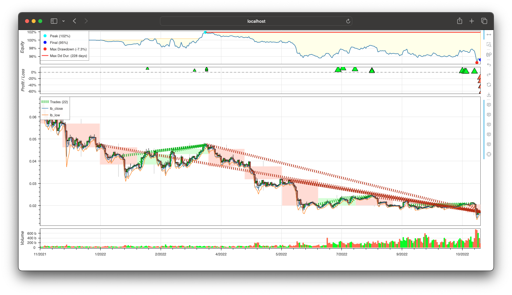
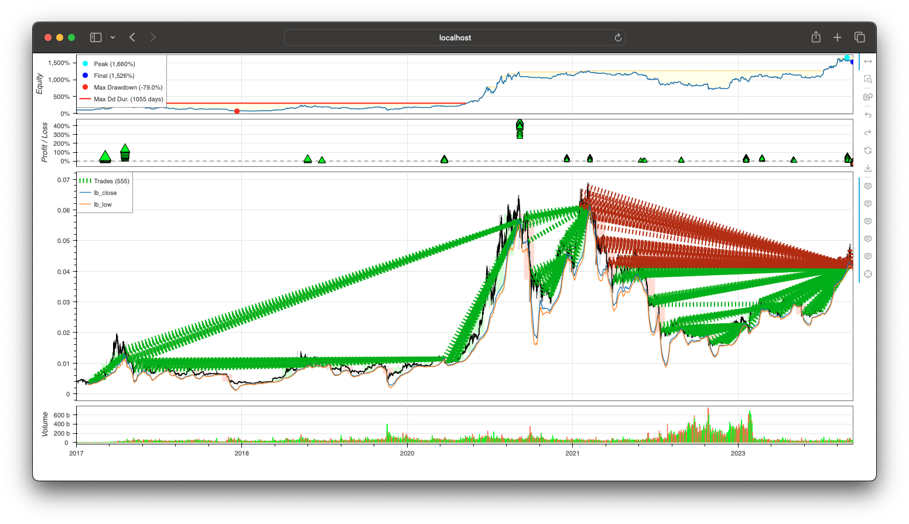

# DCA_Conditional_Buy_LR_with_TrailingStop

!!! note "Note:" 
    This is a work in progress. It's a software configuration guide. This Is Not Financial Advice.

Experiment's source code can be found [here](https://github.com/Pasta-fantasia/backtesting_notebooks).

## Scenarios and best results for BTC

DCA_Conditional_Buy_LR_with_TrailingStop works better on _1 day_ timeframe in any scenario. It took thousands of test sampling ranging dates to discard minute and hourly trading for this strategy.

Sampling moving and overlapping dates helped to reduce the parameters space.  

### Range

From: 2022-06-16 to 2023-03-10.

#### Optimized parameters

- band_length=3
- band_mult=1
- band_low_pct=2.065553230602729
- minimal_benefit_to_start_trailing=1.003
- reinvest=2
- dca_budget=1000
- buy_all_days=0
- lr_buy_longitude=6

#### Results

- Return: **36.37531513528706%** over **-1.2284505259711431%** on buy and hold.
- Initial investment: 1000.0
- Final result: 1363.7531513528706

### Up and Down

From 2019-11-01 to 2022-01-23.

#### Optimized parameters

- band_length=34
- band_mult=2
- band_low_pct=3.0025190627892058
- minimal_benefit_to_start_trailing=1.003
- reinvest=2
- dca_budget=100
- buy_all_days=1
- lr_buy_longitude=10

#### Results

- Return: **965.4840942441458%** over **292.6135311175407%** on buy and hold.
- Initial investment: 1000.0
- Final result: 10654.840942441459

### Bear

From 2021-11-12 to 2022-11-12.

#### Optimized parameters

- band_length=3
- band_mult=1
- band_low_pct=2.8111930348691905
- minimal_benefit_to_start_trailing=1.003
- reinvest=2
- dca_budget=50
- buy_all_days=0
- lr_buy_longitude=11

#### Results

- Return: **-9.49249976588443%** over **-73.78119881357838%** on buy and hold.
- Initial investment: 1000.0
- Final result: 905.0750023411557

### Long Term

From 2017-01-01 to 2024-01-20.

#### Optimized parameters

- band_length=34
- band_mult=2
- band_low_pct=2.815263919591264
- minimal_benefit_to_start_trailing=1.003
- reinvest=2
- dca_budget=100
- buy_all_days=1
- lr_buy_longitude=7

#### Results

- Return: **1487.0788390592738%** over **904.5432166669%** on buy and hold.
- Initial investment: 1000.0
- Final result: 15870.788390592737

## BTC

### Bear

[Binance_BTC-USDT_1d_2021-11-12_2021-11-12_2024-01-20_1525](Bear/Binance_BTC-USDT_1d/index.md)

[Binance_BTC-USDT_1w_2021-11-12_2021-11-12_2024-01-20_1542](Bear/Binance_BTC-USDT_1w/index.md)

### Range

[Binance_BTC-USDT_1d_2022-06-16_2022-06-16_2024-01-20_1515](Range/Binance_BTC-USDT_1d/index.md)

[Binance_BTC-USDT_1w_2022-06-16_2022-06-16_2024-01-20_1537](Range/Binance_BTC-USDT_1w/index.md)

### Up and down

[Binance_BTC-USDT_1w_2019-11-01_2019-11-01_2024-01-20_1555](Up_and_down/Binance_BTC-USDT_1w/index.md)

[Binance_BTC-USDT_1d_2019-11-01_2019-11-01_2024-01-20_1523](Up_and_down/Binance_BTC-USDT_1d/index.md)

[Binance_BTC-USDT_1h_2019-11-01_2019-11-01_2024-01-20_1556](Up_and_down/Binance_BTC-USDT_1h/index.md)

### Long Term

[Binance_BTC-USDT_1w_2017-01-01_2017-01-01_2024-01-20_1543](LongTerm/Binance_BTC-USDT_1w/index.md)

[Binance_BTC-USDT_1d_2017-01-01_2017-01-01_2024-01-20_1526](LongTerm/Binance_BTC-USDT_1d/index.md)

## ETH

### Bear

[Binance_ETH-USDT_1d_2021-11-12_2021-11-12_2024-01-20_1611](Bear/Binance_ETH-USDT_1d/index.md)

### Range

[Binance_ETH-USDT_1d_2022-06-16_2022-06-16_2024-01-20_1612](Range/Binance_ETH-USDT_1d/index.md)

### Up_and_down

[Binance_ETH-USDT_1d_2019-11-01_2019-11-01_2024-01-20_1609](Up_and_down/Binance_ETH-USDT_1d/index.md)

### Long Term
[Binance_ETH-USDT_1d_2017-01-01_2017-01-01_2024-01-20_1610](LongTerm/Binance_ETH-USDT_1d/index.md)

